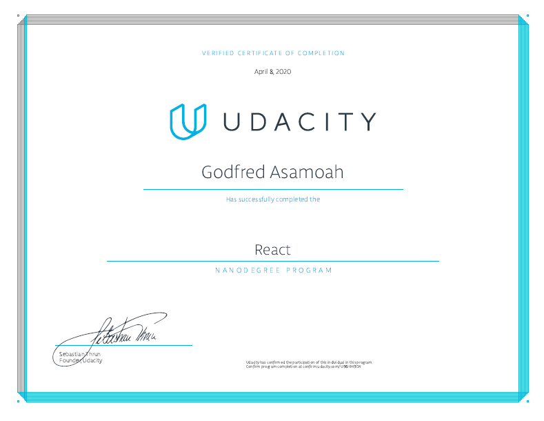

# React Nanodegree Projects

This repository contains my solution materials for Udacity's [React Nanodegree Program](https://www.udacity.com/course/react-nanodegree--nd019) projects.

## Projects

- [1 - MyReads](/1-myreads): A React application to create a virtual bookcase to store books and track what you're reading. Use the provided Books API to search for books and add them to a bookshelf.

- [2 - Would You Rather?](/2-wyr): Would you Rather game where users are given questions and must choose one of them. Built using the state management features of Redux and the component model of React.

- [3 - Flashcards](/3-flashcards): Flashcards app built using React Native.

## Graduation Certificate🎉🎉

[Certificate Link](https://confirm.udacity.com/U96HM9D4)
